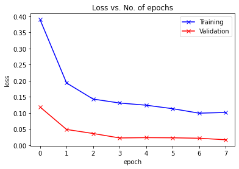
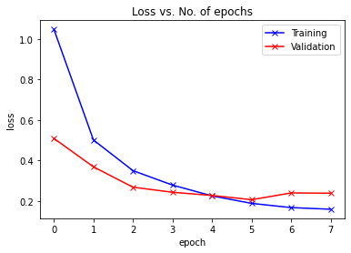

Recycling classifier.

### Datasets
* recycle dataset http://web.cecs.pdx.edu/~singh/rcyc-web/dataset.html      (11,500 images, 5 categories)
* garbage dataset https://www.kaggle.com/asdasdasasdas/garbage-classification   (2400 images, 6 categories)

### Pre-existing work
There is some Pre-existing work using PyTorch and the garbage dataset 

https://towardsdatascience.com/garbage-segregation-using-pytorch-6f2a8a67f92c
    RESNET9 manual implementation  ~83% accuracy
    
https://www.kaggle.com/aadhavvignesh/pytorch-garbage-classification-95-accuracy/notebook
    RESNET50 with last layer replaced ~95% accuracy in 355s (sagemaker ml.p2.xlarge)
    
https://rahulkaranam777.medium.com/how-to-build-a-cnn-for-classifying-garbage-using-pytorch-50510e898fc6
    RESNET50 very similar to the one above (didn't test this one myself)
    

    
### Ideas for improvement

start with aadhavvignesh

Train faster:
* increase lr
* Transfer learning from pretrained resnet 50 rather than training the entire network

improve accuracy:
* more data - try the larger recycle dataset
* different model, try Inception, like this guy https://github.com/russell-li/trash_classification_pytorch used (on a dataset that didn't look great)
* different ResNet implementation (TF?)


####  Learning Rate:
Not sure there is much potential here, lr (5.5e-5) from original work looks pretty good from the training loss plot
tried 9e-5, 15e-5 both unstable.


#### Transfer Learning
* freeze 0/10 layers 355s for 8 epochs - 95% accuracy after 4 epochs overfit 
* freeze first 6/10 layers 236s for 8 epochs - 95% accuracy after about 4 epochs.  Overfit.
* freeze first 7/10 layers 167s for 8 epochs - 94% after 5 epochs overfit but less so.
* freeze first 9/10 layers (entire resnet except the last layer) - 80% accuracy in 62s (lr 7e-4)


#### Inception and Singh dataset
In order to load the singh dataset, I rewrote the data loader so that it performs augmentation (random rotations and cropping of the images) and normalisation of the data.  In order to compare the recycle and garbage datasets fairly, I created a third dataset recycle-small which is a random subset of the recycle data containing the same number of images as the garbage dataset.  I applied the same data augmentation to all three datasets (for training, but not for validation)

I also removed a superfluous sigmoid operation from the original aadhavvignesh notebook.

I've compared the three datasets and the two models below.  I loaded pretrained models for both ResNet and Inception, and I trained the last 7 layers of Inception and the last 3 layers of ResNet.  I trained for 8 epochs (which took about 4 times as long for the larger recycle dataset than for the others).


#### Test Accuracy Comparison

|               | InceptionV3 | Resnet50 |
| ------------- | ----------- | -------- |
| recycle       | 0.993       | 0.995    |
| recycle-small | 0.977       | 0.972    |
| garbage       | 0.944       | 0.973    |


* Better pre-processing to the data has improved the test accuracy of Resnet on the garbage data from about 95% to 97%
* Adding more data (ie. the full recycle dataset) improves the situation further to 99%.
* Inception and ResNet perform similarly - the only difference is on the garbage dataset where Resnet performs better
* Inception was slightly slower to train (but it is a larger network, and I am training more layers)
* The recycle dataset is quite dark, so when a model is trained on the recycle dataset it does a poor job of identifying the external images at the bottom of the notebook - could we adjust the brightness?
* The recycle dataset also has a training loss which is higher than the validation loss.  I would have attributed this to data augmentation (which is applied to the training data, but not to the validation data) however the garbage data does not show such a difference despite having the same pre-processing - this requires further investigation.


#### Resnet training loss (recycle)




#### Resnet training loss (garbage)



### Running the notebook

#### Running on AWS

this will use cloudformation to launch a sagemaker notebook.  The default instance type is ml.t2.medium.  If you actually want to train the model yourself, edit cloudformation.yml to specify and instance type with more compute.

```
#change the name here if you like
stackname='recycle-classifier'
#create the stack
aws cloudformation create-stack --template-body "`cat ./cloudformation.yml`" --stack-name ${stackname} --capabilities CAPABILITY_NAMED_IAM
#find the name of the sagemaker instance
sagemakername=`aws cloudformation list-stack-resources --stack-name ${stackname} | fgrep PhysicalResourceId | grep -oP '(?<=notebook-instance\/)recycleclassifier-[^"]+'`
#print the url of the jupyter notebook
echo "https://`aws sagemaker describe-notebook-instance --notebook-instance-name ${sagemakername} | jq -r .Url`/tree/recycle"
#wait for the notebook to finish loading and go to the url - when asked to choose a kernel go for conda_pytorch_latest_p36
```

to delete the cloudformation stack:
```
aws cloudformation delete-stack --stack-name ${stackname} 
```

#### Running locally

```jupyter notebook```

#### Fetching data and cached models

run all the cells in prepare_data.ipynb

now open the notebook ```pytorch-garbage-classification-95-accuracy-inception.ipynb```

